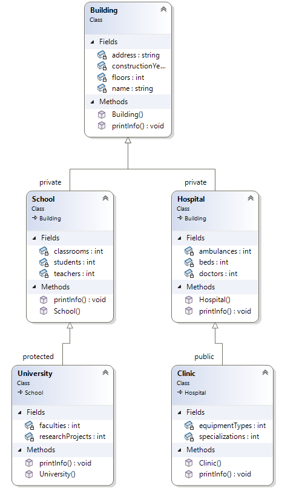

# Наследяване


---
## Задачи
### Задача 1: Основи на наследяването
Създайте клас `Animal`, който има:
* атрибут `name` (стринг)
* метод `speak()`, който връща текст `Some generic sound`.

Създайте производен клас `Dog`, който наследява от `Animal`.
Класът `Dog` трябва да презапише метода `speak()` така, че да връща текста `Woof woof`. Нека в този клас да **НЯМА** атрибути.

Създайте обект от двата класа и извикайте метода `speak()` за всеки от тях.

### Задача 2: Конструктори
Добавете по един конструктор с инициализиращи параметри към двата класа. Нека за входен аргумент имате `string`, съдържащ името на животното. 

Преработете методите `speak()`, така че в тялото им да се включва и името на животното.

```c++
// метод за издаване на звук
string speak() const {
    return name + ": Some generic sound"; // Основен звук
}
    
// Презаписване на метода speak()
string speak() {
    return name + ": Woof woof"; // Специфичен звук за куче
}
```
При създаването на обектите в `main()` програмата, използвайте следния код:
```c++
Animal genericAnimal("some animal");

Dog dog("Buddy");  // или измислете вие име
```
### Задача 3: Множествено наследяване
Създайте следната структура от класове:


Базов клас `Person`, който има:
- `name` (стринг) - име на човека.
- `age` (цяло число) - възраст на човека.
- метод `displayInfo()`, който показва информацията за човека:
`Name: <name>, Age: <age>`

Базов клас `Employee`, който има:
- `company` (стринг) - компания, в която работи.
- `salary` (дробно число) - заплата на служителя.
- метод `displayInfo()`, който показва информацията за служителя:
`Company: <company>, Salary: <salary>`

Производен клас `Manager`, който наследява от `Person` и `Employee`, и има:
- метод `displayInfo()`, който комбинира информацията от двата базови класа в следния формат:

```c++
Name: <name>, Age: <age>
Company: <company>, Salary: <salary>
```

Създайте обект от класа `Manager` и извикайте метода `displayInfo()`.


### Задача 4: Модифициране на задача 3
Към класовете от задача 3, отразете новите изисквания:


- в класа `Employee`:
    - метод `giveRaise(double percent)`, който увеличава заплатата с даден процент.
- в класа `Manager`:
    - атрибут `teamSize` (цяло число), която указва размера на екипа, управляван от мениджъра.
    - метод `addToTeam(int newMembers)`, който увеличава размера на екипа.
    - презаписан метод `displayInfo()`, който показва и размера на екипа.

Създайте обект от класа `Manager`, използвайте методите за увеличение на заплатата и размера на екипа, и покажете актуализираната информация.

### Задача 5: Йерархия от класове
Създайте йерархия от 5 класа, които имат следните характеристики:
- всеки клас трябва да има конструктор, който инициализира специфични атрибути на класа.
- всеки клас трябва да има метод `printInfo()`, който извежда информация за атрибутите на класа.


* Клас `Building`:
  * Атрибути: `name` (име на сградата) и `floors` (брой етажи).
* Клас `School`:
  * Наследява `Building`.
  * Атрибути: `students` (брой ученици) и `teachers` (брой учители).
* Клас `Hospital`:
  * Наследява `Building`.
  * Атрибути: `beds` (брой легла) и `doctors` (брой лекари).
* Клас `University`:
  * Наследява `School`.
  * Атрибути: `faculties` (брой факултети).
* Клас `Clinic`:
  * Наследява `Hospital`.
  * Атрибути: `specializations` (брой специализации).

Създайте обекти от всички класове, като подадете примерни данни, и извикайте методите `printInfo()` за всеки обект.
```c++
int main() {
    // Създаване на обекти
    Building building("Generic Building", 3);
    School school("Green Valley School", 2, 500, 25);
    Hospital hospital("City Hospital", 5, 200, 50);
    University university("Tech University", 6, 3000, 200, 10);
    Clinic clinic("Sunrise Clinic", 2, 50, 10, 5);

    // Извеждане на информация
    cout << "Building Info:" << endl;
    building.printInfo();

    cout << "\nSchool Info:" << endl;
    school.printInfo();

    cout << "\nHospital Info:" << endl;
    hospital.printInfo();

    cout << "\nUniversity Info:" << endl;
    university.printInfo();

    cout << "\nClinic Info:" << endl;
    clinic.printInfo();

    return 0;
}
```

### Задача 6: Модификация на задача 5 - модификатори за достъп
Надградете предишната задача със следните изисквания:



* Добавете нови атрибути към всеки клас:
  * `Building`: `address` (стринг) и `constructionYear` (цяло число).
  * `School`: `classrooms` (цяло число).
  * `Hospital`: `ambulances` (цяло число).
  * `University`: `researchProjects` (цяло число).
  * `Clinic`: `equipmentTypes` (цяло число).
* Променете начина на наследяване:
  * `School` и `Hospital` да наследяват `Building` като `private`.
  * `University` да наследява `School` като `protected`.
  * `Clinic` да наследява `Hospital` като `public`.
* Създайте методи `printInfo()` във всеки клас, които извеждат информация за съответния клас, включително атрибутите от базовия клас (ако са достъпни).
* Създайте обекти от всеки клас и демонстрирайте как работи наследяването в контекста на различните модификатори за достъп.
* Пробвайте да промените някой от начините на наследяване, за да видите как това ще се отрази на резултата от програмата

Използвайте примерните данни по-долу за тест:
```c++
School school("Green Valley School", 2, "123 School St", 1985, 500, 25, 20);
Hospital hospital("City Hospital", 5, "456 Hospital Blvd", 1990, 200, 50, 10);
University university("Tech University", 6, "789 University Ave", 1965, 3000, 200, 50, 10, 25);
Clinic clinic("Sunrise Clinic", 2, "101 Clinic Dr", 2005, 50, 10, 2, 5, 10);
```
Очакван резултат:
```c++
School Info:
Building: Green Valley School, Floors: 2, Address: 123 School St, Construction Year: 1985
Students: 500, Teachers: 25, Classrooms: 20

Hospital Info:
Building: City Hospital, Floors: 5, Address: 456 Hospital Blvd, Construction Year: 1990
Beds: 200, Doctors: 50, Ambulances: 10

University Info:
Building: Tech University, Floors: 6, Address: 789 University Ave, Construction Year: 1965
Students: 3000, Teachers: 200, Classrooms: 50
Faculties: 10, Research Projects: 25

Clinic Info:
Building: Sunrise Clinic, Floors: 2, Address: 101 Clinic Dr, Construction Year: 2005
Beds: 50, Doctors: 10, Ambulances: 2
Specializations: 5, Equipment Types: 10
```


---
## Допълнителни ресурси
1. 