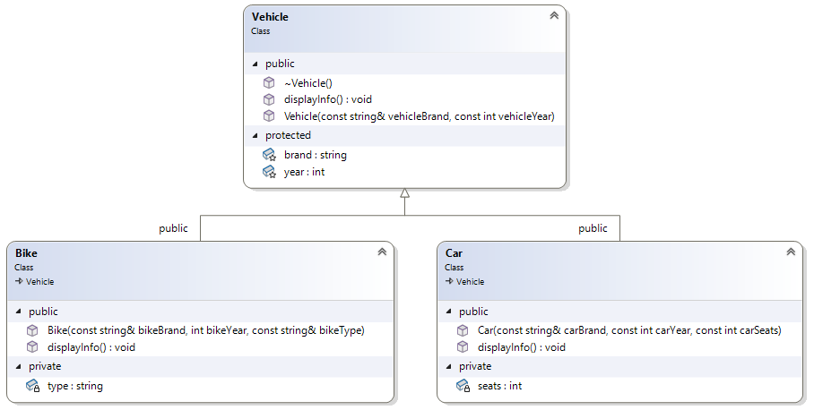
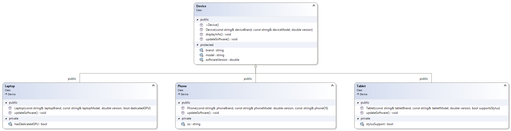

# Виртуални класове, методи. Полиморфизъм


---
## Задачи
### Задача 1: Диамантен проблем + творческо мислене
Реализирайте следната структура:
1) Базов клас: `Person` 
   - Атрибути:
     - `string name` 
     - `int age` 
   - Методи:
     - `void display()` – извежда името и възрастта
     - метод, по ваш избор (вие го измисляте)
   - Конструктор с параметри
2) Произведени класове: `Teacher` и `Researcher`, които наследяват `Person`.
   - Клас `Teacher`:
     - Атрибути:
       - `string subject`
       - `int teachingHours`
     - Методи:
       - `void teach()` – извежда преподаван предмет и брой часове
       -  метод, по ваш избор (вие го измисляте)
     - Конструктор с параметри
   - Клас `Researcher`:
     - Атрибути:
       - `string field`
       - `int publications`
     - Методи:
       - `void research()` – извежда област на изследване и брой публикации
       -  метод, по ваш избор (вие го измисляте)
     - Конструктор с параметри
3) Клас `Professor`, който наследява както `Teacher`, така и `Researcher`.
   - Атрибути:
     - `string title` 
     - `int yearsOfExperience`
   - Методи:
     - `void work()` – извежда информация от всички базови и собствени атрибути.
     -  метод, по ваш избор (вие го измисляте)
   - Конструктор с параметри

Създайте `main()` функция, в която създайте по един обект от всеки клас. За всеки обект извикайте и двата му метода.

### Задача 2: Основен пример за виртуален метод, конструктори и полиморфизъм
Създайте йерархията от диаграмата.



Създайте масив от указатели към `Vehicle`, съдържащ обекти от `Car` и `Bike`, и използвайте механизма на _полиморфизма_ за извикване на метода `displayInfo()`.

### Задача 3: Виртуални методи
Създайте програма, реализираща йерархията от фигурата:


В `main()` функцията, създайте масив от указатели към обектите на класовете и попълнете липсващите части:

```c++
int main() {
    Device* devices[] = ...

    // Показване на информацията преди промяната на данните
    cout << "Before update:\n";
    ...

    // Извикване на метода за промяна на данните
    ...

    // Показване на информацията след промяната
    cout << "\nAfter update:\n";
    ...

    // Освобождаване на паметта
    ...

    return 0;
}
```

---
## Допълнителни ресурси
1. Override vs Overload - https://ca.indeed.com/career-advice/career-development/overloading-vs-overriding 
2. Статично и динамично свързване - https://medium.com/@sugamnp/static-and-dynamic-binding-9cc4547c2fe5
